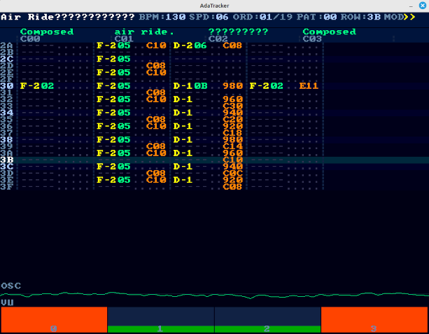
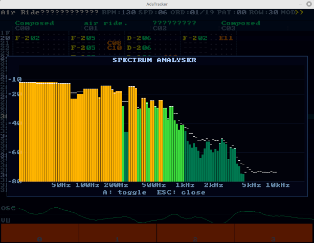
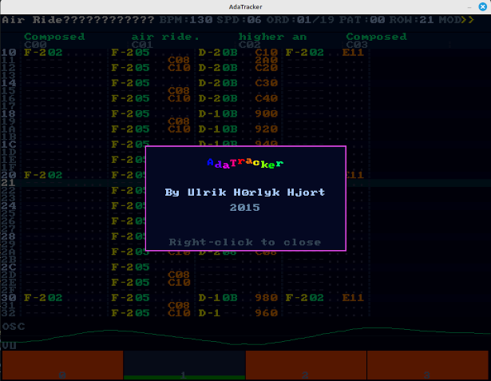

# Ada Tracker

A MOD, XM, S3M, and IT **[music tracker](https://en.wikipedia.org/wiki/Music_tracker)** writen in Ada, using SDL2 for audio output and UI rendering.


## Screenshots
### Main

### Analyzer

### About



## Features

- Plays **MOD** (ProTracker / Amiga), **XM** (FastTracker II), **S3M** (ScreamTracker 3), and **IT** (ImpulseTracker) files
- Full effect support: portamento, vibrato, tremolo, arpeggio, volume/panning slides, pattern loop, pattern delay, and more
- Volume and panning envelopes with sustain and loop (XM + IT)
- IT compressed samples (8-bit and 16-bit delta coding, it215 second-order predictor)
- IT New Note Action (NNA) - background voice pool for layered notes
- XM auto-vibrato and fadeout
- 4-point cubic Hermite (Catmull-Rom) sample interpolation
- Amiga hard-panning for MOD (channels 0/3 left, 1/2 right)
- Pattern editor with live playback position, channel info strip, and active instrument names
- Oscilloscope waveform display
- Real-time spectrum analyser (2048-point FFT, log-scaled 20 Hz - 20 kHz, peak hold)
- Per-channel VU meters and mute
- In-app file browser - navigate directories and load songs without restarting
- PRotected objects for thread-safe sequencer <-> mixer communication

## Dependencies

- GNAT Ada compiler (`gprbuild`)
- SDL2 (`libsdl2-dev`)

## Build

```sh
make
```

Use `gprbuild` if available, fall back to `gnatmake` automatic. Or build directly:

```sh
gprbuild -P tracker.gpr
```

### Install

```sh
make install              # install to /usr/local/bin/tracker
make install PREFIX=~/.local
```

## Usage

```sh
./bin/tracker_main [file.mod|file.xm|file.s3m|file.it]
```

If no file is given, the in-app file browser opens automatic.

### Keyboard shortcuts

| Key | Action |
|-----|--------|
| `Space` | Play / Pause |
| `Esc` | Quit (or close open popup) |
| `O` | Open file browser |
| `W` | Export current song to WAV |
| `A` | Toggle spectrum analyser |
| `<-` / `->` | Jump to previous / next order |
| `Page Up` / `Page Down` | BPM +1 / -1 |
| `F1`-`F8` | Toggle mute on channels 1-8 |
| `F5` | Jump to start |
| Right-click | Toggle About popup |

**File browser:** Key Up/Key Down navigate, `Enter` load file or enter directory, `Esc` cancel.


## Supported effects

### MOD / XM / S3M / IT (common)

| Effect | Description |
|--------|-------------|
| `0xy` | Arpeggio |
| `1xx` | Portamento up |
| `2xx` | Portamento down |
| `3xx` | Tone portamento |
| `4xy` | Vibrato |
| `5xy` | Tone portamento + volume slide |
| `6xy` | Vibrato + volume slide |
| `7xy` | Tremolo |
| `8xx` | Set panning |
| `9xx` | Sample offset |
| `Axy` | Volume slide |
| `Bxx` | Jump to order |
| `Cxx` | Set volume |
| `Dxx` | Pattern break |
| `Fxx` | Set speed / BPM |

### XM extended effects (`Exy`)

| Effect | Description |
|--------|-------------|
| `E1x`/`E2x` | Fine portamento up/down |
| `E4x`/`E7x` | Set vibrato/tremolo waveform |
| `E5x` | Set finetune |
| `E6x` | Pattern loop |
| `E8x` | Set panning |
| `E9x` | Retrigger |
| `EAx`/`EBx` | Fine volume slide up/down |
| `ECx` | Note cut |
| `EDx` | Note delay |
| `EEx` | Pattern delay |
| `Txx` | Set BPM |
| `Pxx` | Panning slide |

### IT-specific volume column commands

| Value | Description |
|-------|-------------|
| `0`-`64` | Set volume |
| `65`-`74` | Fine volume slide up |
| `75`-`84` | Fine volume slide down |
| `85`-`94` | Volume slide up |
| `95`-`104` | Volume slide down |
| `128`-`192` | Set panning |
| `193`-`202` | Portamento |
| `203`-`212` | Vibrato |


## Resources
**[Mod Archive - download music modules for the tracker here ](https://modarchive.org/)**